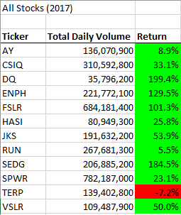
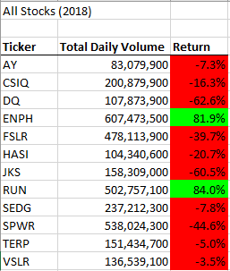
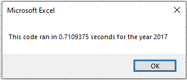
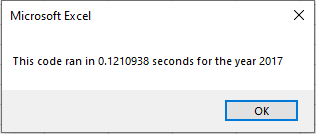
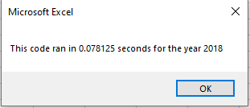

# stock-analysis

## Overview of Project
The purpose of this analysis was to refactor existing code with the goal of expanding the utility of the code while also making the code more efficient so that it executes faster than the original code.  This written analysis explains in detail how the analysis was performed including links to pertinent images as well as a detailed review of the results. Finally, the advantages and disadvantages of refactoring code are discussed as well as how those pros and cons apply to refactoring the original code.

## Results
When we compare the stock performance between 2017 and 2018 we are able to observe a few differences between the two years.  One of the first things that was observed during the comparison is that in 2017, 11 of the 12 stocks analyzed had a positive return while in 2018 only 2 of those same 12 stocks had a positive return.  This stark contrast is easily observed when we view the 2017 and 2018 charts next to each other.     When we compare the execution times of the original code to the refactored code, we observe that the runtimes of the refactored code are much faster for the refactored code.  When we analyze the stocks for 2017 using the original code, the execution time is approximately 0.7109 seconds compared to the refactored code for 2017 which had an execution time of approximately 0.1211 seconds.     When we analyze the stocks for 2018, we observe a similar reduction in execution time with the original code executing in approximately 0.7070 seconds compared to an execution time of approximately 0.0781 seconds.  

## Summary
When refactoring code there are both advantages and disadvantages.  One of the major advantages of refactoring code is that, depending on how long the code is, it can save you a lot of time, especially if it is code that you wrote and are already familiar with.  Another advantage of refactoring the code is that we can reduce the complexity of the code to make it more readable; by doing so we can ultimately make the code more efficient and improve execution times.  One of the disadvantages of refactoring code is that there is always the potential to make mistakes and in the refactoring process there is a chance that you introduce new bugs into the code.  In regards to the process of refactoring the original VBA script, one of the pros was that I had written the original code so I was very familiar with the script prior to the refactoring process.  In contrast, one of the cons in the refactoring process is that I did end up introducing new bugs in the code that had to be debugged.  Ultimately, time was not a hinderance in the refactoring process and the result is that the refactored code executes faster and is more readable than the original code.
